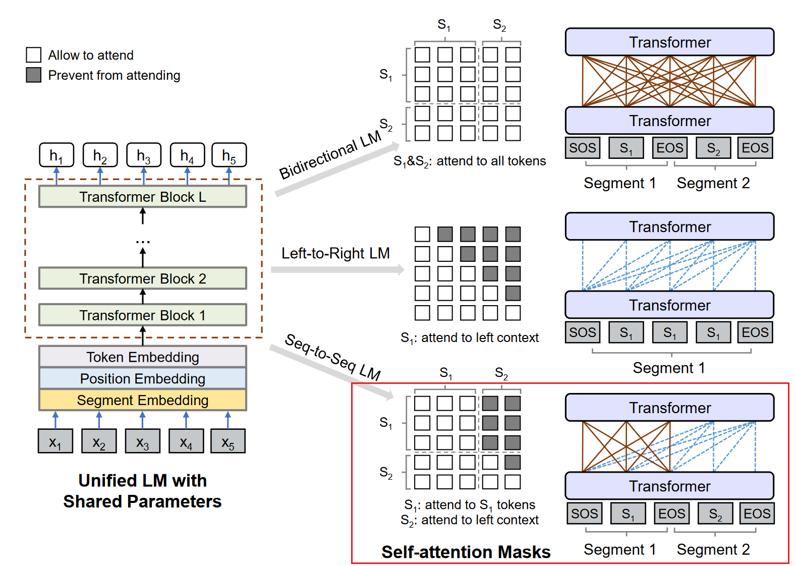

# transformers-unilm

[中文](README.md)|English

## Introduction

UniLM is proposed by MSR in 2019, which utilize the BERT model architecture and MLM task for both text NLU and NLG, and has achieved state-of-the-art performance on abstractive summarization task. See the [paper](https://arxiv.org/abs/1905.03197) for more details.

[Huggingface Transformers](http://github.com/huggingface/transformers) seems not to support UniLM for Seq2Seq training and inference. **This repo implements UniLM for Seq2Seq in huggingface transformers style, and is compatible with the huggingface traning and inference pipelines.** 

Although the UniLM model supports 4 kinds of language modeling, which are left-to-right LM, right-to-left LM, bidirectional LM, and seq-to-seq LM, this repo only supports seq-to-seq LM, since the others are for NLU tasks and easy to be implemented using huggingface BERT directly.

- Datasets & Pretrained Models: See [the official UniLM repo](https://github.com/microsoft/unilm/tree/master/unilm-v1)
- Also see [Huggingface Pretrained Model](https://huggingface.co/microsoft/unilm-base-cased)
- [Weibo Chinese News Article Summarization Dataset](https://pan.baidu.com/s/1-OxrZRm_Q7ejfU-mtngBWg?pwd=85t5)

## Usage

### Quick Start

Doing Chinese news article summarization

```sh
pip install git+https://github.com/Liadrinz/transformers-unilm
```

```py
from unilm import UniLMTokenizer, UniLMForConditionalGeneration


news_article = (
    "12月23日，河北石家庄。8岁哥哥轻车熟路哄睡弟弟，姿势标准动作熟练。"
    "妈妈杨女士表示：哥哥很喜欢弟弟，因为心思比较细，自己平时带孩子的习惯他都会跟着学习，"
    "哄睡孩子也都会争着来，技巧很娴熟，两人在一块很有爱，自己感到很幸福，平时帮了自己很大的忙，感恩有这么乖的宝宝。"
)

tokenizer = UniLMTokenizer.from_pretrained("Yuang/unilm-base-chinese-news-sum")
model = UniLMForConditionalGeneration.from_pretrained("Yuang/unilm-base-chinese-news-sum")  # fine-tuned on weibo news article summarization dataset

inputs = tokenizer(news_article, return_tensors="pt")
output_ids = model.generate(**inputs, max_new_tokens=16)
output_text = tokenizer.decode(output_ids[0])
print(output_text)  # "[CLS] <news_article> [SEP] <news_summary> [SEP]"
news_summary = output_text.split("[SEP]")[1].strip()
print(news_summary)
```

### Train

```python
from unilm import UniLMTokenizer, UniLMForConditionalGeneration
from unilm.collator import DataCollatorForUniLMSeq2Seq

tokenizer = UniLMTokenizer.from_pretrained("microsoft/unilm-base-cased")
model = UniLMForConditionalGeneration.from_pretrained("microsoft/unilm-base-cased")

source = "We propose a new simple network architecture, the Transformer, based solely on attention mechanisms, dispensing with recurrence and convolutions entirely."
target = "New simple network architecture Transformer is proposed."
inputs = tokenizer(source, target)

collator = DataCollatorForUniLMSeq2Seq(tokenizer, mlm=True, mlm_probability=0.7)
batch = collator([inputs])
print(batch["input_ids"])
print(batch["labels"])

outputs = model(**batch)
print(outputs.loss)
print(outputs.logits)
```

### Inference

```python
from unilm import UniLMTokenizer, UniLMForConditionalGeneration

tokenizer = UniLMTokenizer.from_pretrained("microsoft/unilm-base-cased")
model = UniLMForConditionalGeneration.from_pretrained("microsoft/unilm-base-cased")

inputs = tokenizer("Attention is all you need.", return_tensors="pt")

outputs = model.generate(**inputs, max_new_tokens=32, num_return_sequence=5, num_beams=5, no_repeat_ngram_size=3)

print(tokenizer.decode(outputs[0]))
```

## Components

### Main

- `unilm.modeling_unilm.UniLMForConditionalGeneration` unifies the training and inference of UniLM Seq2Seq.
- `unilm.modeling_unilm.UniLMTokenizer` is similar to `BertTokenizer`, except:
    - token_type_ids is configured by `src_type_id` and `tgt_type_id`, which mean the token_type_id of source and target sequence, respectively. According ot the official implementation, `src_type_id` is default to 4, and `tgt_type_id` is default to 5
    - `get_special_tokens_mask` does not regard the `[SEP]` token at the end of the target sequence as a special token, so that the `[SEP]` will have a chance to be masked by `DataCollatorForUniLMSeq2Seq` during training. This will enable the model to learn when to end the sentence generation. (See [paper](https://arxiv.org/abs/1905.03197) for more detail).
- `unilm.modeling_unilm.UniLMConfig` is similar to `BertConfig`, except:
    - Adding `src_type_id`, `tgt_type_id`, `bos_token_id`, `eos_token_id`, and `mask_token_id`

### Others

- `unilm.modeling_unilm.UniLMModel`: Compared to `BertModel`, it supports UniLM seq2seq attention mask:

    

- `unilm.modeling_unilm.UniLMSelfAttention`: The attention employed during inference is kind of different from common `BertSelfAttention`, see this code or official implementation for more detail.

## Summarization Task

See `examples/summarization`

### Train

```sh
python3 -m torch.distributed.launch --nproc_per_node 4 run_summary.py train \
    --model_type unilm \
    --model_name_or_path microsoft/unilm-base-cased \
    --batch_size 16 \
    --src_file train.src \
    --tgt_file train.tgt \
    --max_src_len 448 \
    --max_tgt_len 64 \
    --seed 42 \
    --output_dir ./output_dir \
    --gradient_accumulation_steps 2 \
    --lr 0.00003 \
    --num_train_epochs 10 \
    --mask_prob=0.7 \
    --fp16
```

Options:

- `--model_name_or_path` is the local or remote path of the huggingface pretrained model
- `--mask_prob`: the probability of the target token to be masked during fine-tuning

### Decoding

```sh
python3 -u run_summary.py decode \
    --model_type unilm \
    --model_name_or_path microsoft/unilm-base-cased \
    --model_recover_path ./output_dir/checkpoint-xxx/pytorch_model.bin \
    --batch_size 16 \
    --src_file test.src \
    --tgt_file test.tgt \
    --max_src_len 448 \
    --max_tgt_len 64 \
    --seed 42 \
    --beam_size 2 \
    --output_candidates 1\
    --do_decode \
    --compute_rouge
```

Options:

- `--model_recover_path` is the path of the fine-tuned model
- `--beam_size` is the beam size of beam search
- `--output_candidates` specifies how many candidates of beam search to be output to file, which should be larger than 0 and no more than the `beam_size`
- `--do_decode`: Whether to do decoding
- `--compute_rouge`: Whether to compute ROUGE score after decoding. If `output_candidates > 1`, the average ROUGE score of all candidates will be calculated.

P.S. If the `model_recover_path` is `./output_dir/checkpoint-xxx/pytorch_model.bin`, the decoding output file will be `./output_dir/checkpoint-xxx/pytorch_model.bin.decode.txt`

## Inference Performance

Inference speeds up compared to official implementaion, but GPU usage also increases.

- Settings

    |||
    |:--|--:|
    |GPU|1 x RTX 3060 6GB|
    |Dataset|first 1k of CNN/DailyMail testset|
    |Max Source Length|448|
    |Max Target Length|64|
    |Beam Size|3|

- Inference Time

    |Batch Size|[microsoft/unilm](https://github.com/microsoft/unilm/tree/master/unilm-v1)|Liadrinz/transformers-unilm|speed-up ratio|
    |--:|--:|--:|--:|
    |1|1070s|1020s|1.05|
    |2|713s|595s|1.20|
    |4|623s|388s|1.61|
