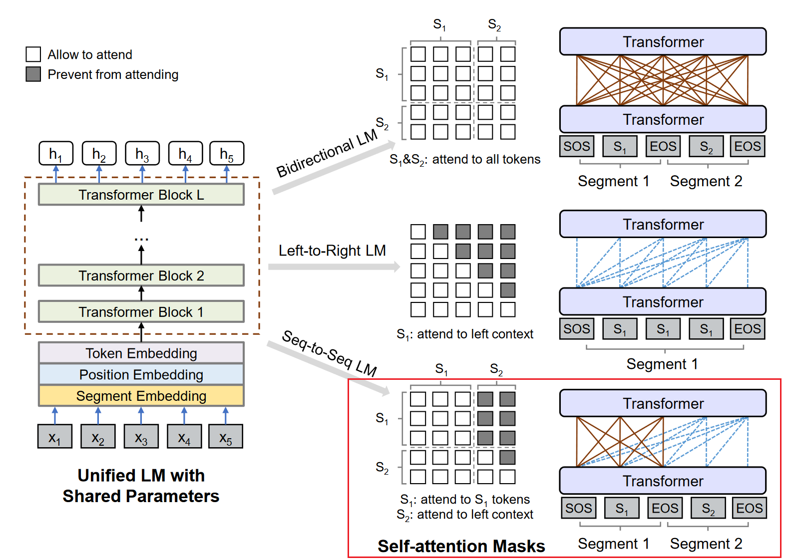

# transformers-unilm

[English](README.md)

## 介绍

UniLM是微软研究院于2019年提出的语言模型，利用了BERT模型架构和MLM任务，既能做NLU又能做NLG，并且在生成式摘要任务上取得了SOTA的效果。详见[论文](https://arxiv.org/abs/1905.03197)。

目前比较流行的UniLM代码有以下版本：
- https://github.com/microsoft/unilm/tree/master/unilm-v1 (Official)
- https://github.com/YunwenTechnology/Unilm

[Huggingface Transformers](http://github.com/huggingface/transformers)似乎还不支持用UniLM做Seq2Seq的训练和推断。**该代码用huggingface transformers的风格实现了用UniLM来做Seq2Seq，并兼容huggingface的训练和推理流程。**

UniLM模型支持4种语言建模任务：从左到右单向LM、从右到左单向LM、双向LM和seq-to-seq LM. 该代码仅支持seq-to-seq LM，因为另外三种都是用于NLU任务的，且能直接简单地用huggingface BERT实现。

- 数据集和预训练模型见[UniLM官方仓库](https://github.com/microsoft/unilm/tree/master/unilm-v1)
- 也可以使用[Huggingface预训练模型](https://huggingface.co/microsoft/unilm-base-cased)

## 安装

```sh
python setup.py install
```

或

```sh
pip3 install -e .
```

## 用法

### 训练

```python
from unilm import UniLMTokenizer, UniLMForConditionalGeneration
from unilm.collator import DataCollatorForUniLMSeq2Seq

tokenizer = UniLMTokenizer.from_pretrained("microsoft/unilm-base-cased")
model = UniLMForConditionalGeneration.from_pretrained("microsoft/unilm-base-cased")

source = "We propose a new simple network architecture, the Transformer, based solely on attention mechanisms, dispensing with recurrence and convolutions entirely."
target = "New simple network architecture Transformer is proposed."
inputs = tokenizer(source, target)

collator = DataCollatorForUniLMSeq2Seq(tokenizer, mlm=True, mlm_probability=0.7)
batch = collator([inputs])
print(batch["input_ids"])
print(batch["labels"])

outputs = model(**batch)
print(outputs.loss)
print(outputs.logits)
```

### 解码

```python
from unilm import UniLMTokenizer, UniLMForConditionalGeneration

tokenizer = UniLMTokenizer.from_pretrained("microsoft/unilm-base-cased")
model = UniLMForConditionalGeneration.from_pretrained("microsoft/unilm-base-cased")

inputs = tokenizer("Attention is all you need.", return_tensors="pt")

outputs = model.generate(**inputs, max_new_tokens=32, num_return_sequence=5, num_beams=5, no_repeat_ngram_size=3)

print(tokenizer.decode(outputs[0]))
```

## 模块

### 主要

- `unilm.modeling_unilm.UniLMForConditionalGeneration` 同一了UniLM Seq2Seq的训练和推理流程
- `unilm.modeling_unilm.UniLMTokenizer`和`BertTokenizer`相似，但有以下不同：
    - token_type_ids可由`src_type_id`和`tgt_type_id`配置，这两项分别表示源序列和目标序列的token_type_id. 根据官方实现，`src_type_id`默认值为4，`tgt_type_id`默认值为5
    - `get_special_tokens_mask`将位于目标序列结尾的`[SEP]` 视为非特殊token，从而这个`[SEP]`在训练时有机会被`DataCollatorForUniLMSeq2Seq`遮盖掉，这样可以让模型学习何时结束生成。（详见[论文](https://arxiv.org/abs/1905.03197)）
- `unilm.modeling_unilm.UniLMConfig`与`BertConfig`相似，但有以下不同:
    - 加入了`src_type_id`, `tgt_type_id`, `bos_token_id`, `eos_token_id`, 和`mask_token_id`

### 其他

- `unilm.modeling_unilm.UniLMModel`: 与`BertModel`相比支持了UniLM seq2seq任务的attention mask:

    

- `unilm.modeling_unilm.UniLMSelfAttention`: 推理阶段使用的attention与普通的`BertSelfAttention`不太一样，详见本代码或官方实现。

## 摘要任务

另详见`train_summary.sh`和`decode_summary.sh`

### 训练

```sh
python3 -m torch.distributed.launch --nproc_per_node 4 run_summary.py train \
    --model_type unilm \
    --model_name_or_path microsoft/unilm-base-cased \
    --batch_size 16 \
    --src_file train.src \
    --tgt_file train.tgt \
    --max_src_len 448 \
    --max_tgt_len 64 \
    --seed 42 \
    --output_dir ./output_dir \
    --gradient_accumulation_steps 2 \
    --lr 0.00003 \
    --num_train_epochs 10 \
    --mask_prob=0.7 \
    --fp16
```

参数说明:

- `--model_name_or_path`是huggingface预训练模型的路径（本地或远程路径）
- `--mask_prob`: fine-tuning时target中的token被mask的概率

### 解码

```sh
python3 -u run_summary.py decode \
    --model_type unilm \
    --model_name_or_path microsoft/unilm-base-cased \
    --model_recover_path ./output_dir/checkpoint-xxx/pytorch_model.bin \
    --batch_size 16 \
    --src_file test.src \
    --tgt_file test.tgt \
    --max_src_len 448 \
    --max_tgt_len 64 \
    --seed 42 \
    --beam_size 2 \
    --output_candidates 1\
    --do_decode \
    --compute_rouge
```

参数说明:

- `--model_recover_path`是fine-tuned模型的路径
- `--beam_size`是beam search中beam的大小
- `--output_candidates`指定输出多少个beam search的候选结果，必须大于0小于`beam_size`
- `--do_decode`: 是否进行解码
- `--compute_rouge`: 解码后是否计算ROUGE分数。如果`output_candidates > 1`，计算的是所有候选结果ROUGE的平均值。

P.S. 如果`model_recover_path`是`./output_dir/checkpoint-xxx/pytorch_model.bin`，解码结果会输出到`./output_dir/checkpoint-xxx/pytorch_model.bin.decode.txt`

## 推理性能

相比官方实现，推理速度有提升，但显存开销也有增加。

- 场景

    |||
    |:--|--:|
    |GPU|1 x RTX 3060 6GB|
    |Dataset|CNN/DailyMail测试集前1k条|
    |Max Source Length|448|
    |Max Target Lenngth|64|
    |Beam Size|3|

- 推理时间

    |Batch Size|[microsoft/unilm](https://github.com/microsoft/unilm/tree/master/unilm-v1)|Liadrinz/transformers-unilm|加速比|
    |--:|--:|--:|--:|
    |1|1070s|1020s|1.05|
    |2|713s|595s|1.20|
    |4|623s|388s|1.61|
